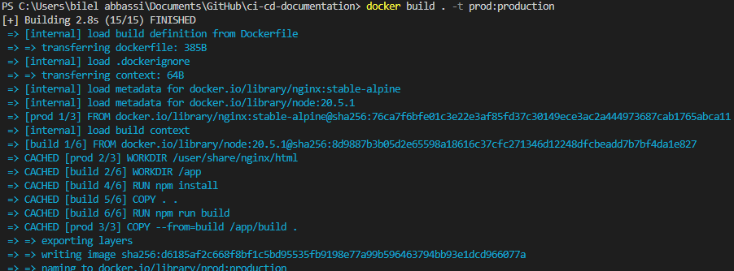
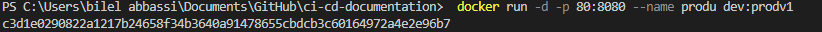

# Docker


# Docker overview

Docker is an open platform for developing, shipping, and running applications. Docker enables you to separate your applications from your infrastructure so you can deliver software quickly. With Docker, you can manage your infrastructure in the same ways you manage your applications. By taking advantage of Docker's methodologies for shipping, testing, and deploying code, you can significantly reduce the delay between writing code and running it in production.


# Docker architecture


 
#  dockerfile 
```
FROM node:20.5.1 as dev
WORKDIR /app
COPY package*.json .
RUN npm install
COPY . . 
EXPOSE 3000            
CMD [ "npm","run","start" ] 

FROM node:20.5.1 as build
WORKDIR /app
COPY package*.json .
RUN npm install
COPY . . 
RUN npm run build


FROM nginx:stable-alpine as prod
WORKDIR /user/share/nginx/html
COPY --from=build /app/build .

```


#  docker build
```
 docker build . -t prod:production
```


# docker run 
```
  docker run -d -p 80:8080 --name production prod:production

 
